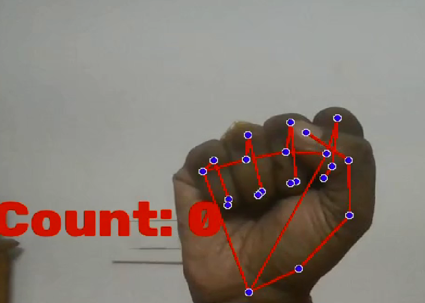
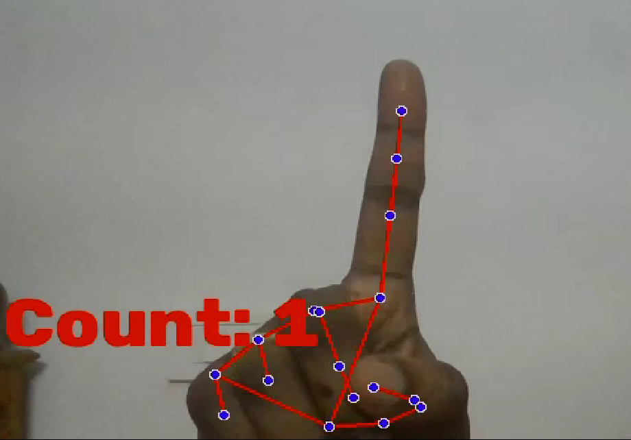
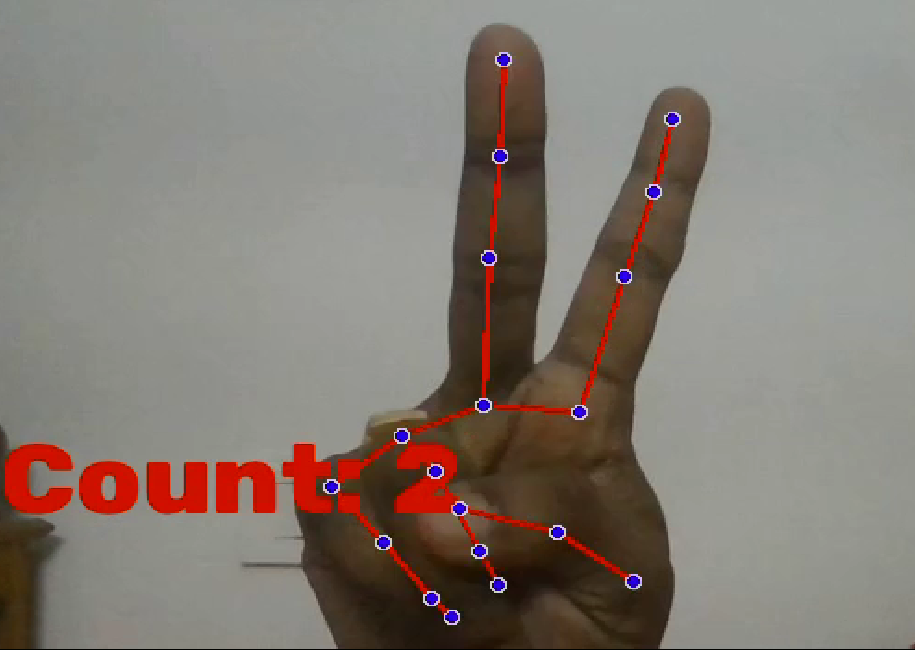
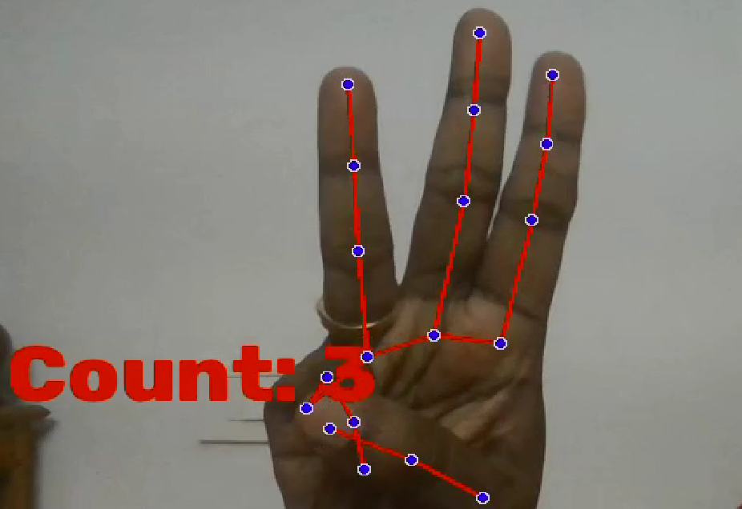
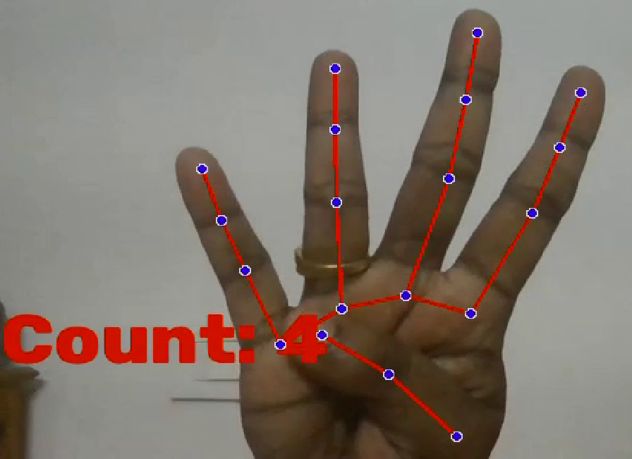
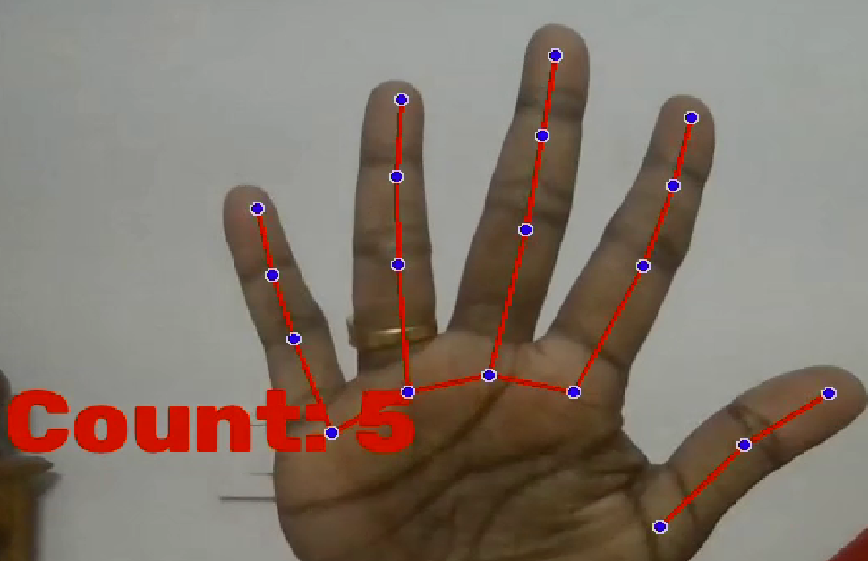

# Finger Counter using MediaPipe

A real-time finger counting application built using Python, OpenCV, and MediaPipe. The program detects a hand through a webcam, tracks hand landmarks, and counts the number of fingers that are raised.

## Features

- Real-time hand detection
- Finger counting using hand landmarks
- Works with a webcam
- Fast and lightweight

## Technologies Used

- Python
- OpenCV
- MediaPipe

## How It Works

1. Captures video from the webcam.
2. Detects hand landmarks using MediaPipe Hands.
3. Determines which fingers are raised.
4. Displays the total finger count on the screen.

## Screenshots

